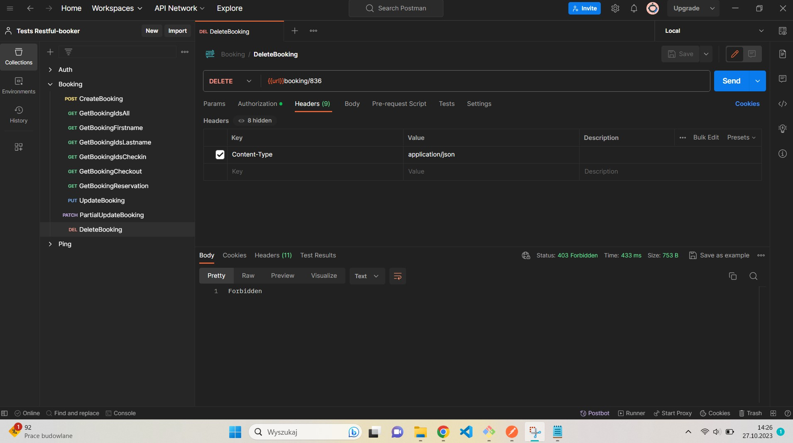

# Testy API strony aplikacji <a href="https://restful-booker.herokuapp.com/apidoc/index.html#api-Auth">Restful-booker.</a>

## Aplikacja Restful-booker słóży do dodawania, usuwania i aktualizowania oraz przeglądania rezerwacji pobytu w hotelu.

## Testy zaplanowałam w aplikacji Jira a wykonałam w aplikacji Postman.

## Poniżej znajduje się raport z przeprowadzonych testów.

### Plan testów:

### 

### 

### 

### Wyeksportowane pliki JASON z Postman:

### <a href="https://drive.google.com/file/d/1Y6Ijuk4eOxQFENcHXV28Fpx-epEtAtVJ/view?usp=sharing">Auth.postmn_collection.jason</a>

### <a href="https://drive.google.com/file/d/1y2BNpqfCcR9ofx0BUi1ZqqttqNZ_b87H/view?usp=sharing">Booking.postmn_collection.jason</a>

### <a href="https://drive.google.com/file/d/1wDKKkV-_i-lhXZs1XzJD3jCiKMeT2744/view?usp=sharing">Ping.postmn_collection.jason</a>

### Wykonanie testów:

### AdminLogin 

### BookingCreateBooking 

### GetBookingIdsAll 

### GetBookingFirstname 

### GetBookingLastname 

### GetBookingCheckin 

### GetBookingCheckout 

### GetBookingReservation 

### UpdateBooking 

### UpdateBooking-token 

### PartialUpdateBooking 

### PartialUpdateBooking-token 

### DeleteBooking 

### HealthCheck 

### Raporty błędów stworzone w aplikacji Jira:

### TRB-7 

### TRB-8 

### TRB-9 

### TRB-10 

### TRB-11 
